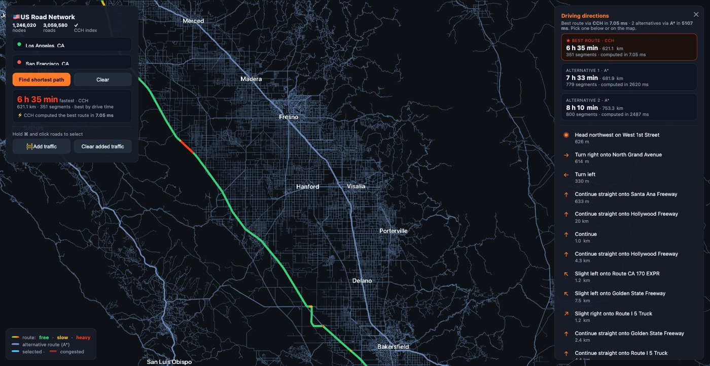

# FalkorDB CCH Demo — Road-Network Routing

Point-to-point driving directions on a **real, million-node road network**, powered
by FalkorDB's **Customizable Contraction Hierarchies (CCH)** path index. The demo loads
the **California** road network (1.24M intersections / 3.06M directed road
arcs), builds a CCH index over drive time, and serves an interactive map that routes
between any two addresses in **single-digit milliseconds** — with live traffic
(congestion), turn-by-turn directions, and A\* alternative routes.



## What it demonstrates

- **CCH as a graph-level index.** `CREATE CCH INDEX FOR ()-[e:ROAD]->() ON (e.time)`
  builds a path index whose shortcut arcs and node ranks live *inside* the index — the
  graph stays a clean `Intersection`/`ROAD` network. Routing is answered by
  `db.idx.cch.query`, which returns the fully-unpacked road path.
- **Sub-10 ms routing at scale.** A ~620 km Los Angeles → San Francisco route is found
  by CCH in **~7 ms**, versus ~2.5 s for each A\* alternative on the same graph.
- **Drive-time routing.** Each road arc carries a `time = length / speed` (speed by OSM
  road class), so the best route is the *fastest*, favouring highways realistically.
- **Live congestion — the "C" in CCH.** ⌘-click roads and **Add traffic** to raise their
  `time`. That's a *weight* change, so the index **recustomizes** in ~10–100 ms (no full
  rebuild) and re-routes around the jam. The route is coloured green → amber → red.
- **Turn-by-turn directions** and up to **K=3 alternative routes** (CCH best + two A\*).

## Prerequisites

- **Docker** (Docker Desktop running) — pulls the CCH-enabled `falkordb/falkordb:edge-c`
  image. The `db.idx.cch.*` procedures are **only** in the `edge-c` tag.
- **Python 3.12** (a virtualenv is created automatically).
- ~2 GB disk for the California OSM extract and ~3 GB free RAM in Docker's VM for the
  CCH build. (California fits the stock 7.65 GB Docker Desktop VM ~2.6× over.)

> The road dataset is **not** committed to this repo — `setup_us.sh` downloads the
> California extract from [Geofabrik](https://download.geofabrik.de/) and builds the
> graph locally.

## Quick start

```bash
./run.sh
```

The first run creates the Python venv, downloads the California OSM extract (~1.2 GB),
parses it, starts FalkorDB (`edge-c`), bulk-loads the graph, builds the CCH index, and
serves the map. Later runs reuse the built graph and start immediately.

Then open **http://localhost:8082**.

Drop a source and destination (type an address, or click the map), and the fastest
route is drawn instantly via `db.idx.cch.query`. ⌘-click roads → **Add traffic** to see
the index recustomize and re-route.

- Rebuild the graph without serving: `./setup_us.sh`
- Stop the web app + DB container: `./run.sh stop`

## The data model

- **Nodes:** `(:Intersection {osmid, lat, lon})` — junctions / dead-ends only (degree-2
  chains are contracted; the real curved geometry is kept in `geom.json` for the map).
- **Edges:** `[:ROAD {weight, time}]`, **directed** — one-way streets emit a single arc,
  two-way streets emit both, so routing respects one-way streets. `weight` = geodesic
  length in metres; `time` = drive-time seconds.
- **The CCH adds nothing to the graph.** The index is created/queried/dropped with:
  ```cypher
  CREATE CCH INDEX FOR ()-[e:ROAD]->() ON (e.time)
  CALL   db.idx.cch.query({sourceNode, targetNode, relTypes:['ROAD'], weightProp:'time'})
  DROP   CCH INDEX FOR ()-[e:ROAD]->() ON (e.time)
  ```
  Changing an arc's `time` (congestion) is absorbed by the index's incremental
  maintenance — the next query re-routes with no manual rebuild.

## California results (this dataset)

| metric | value |
|--------|-------|
| graph | **1,246,020** intersections / **3,059,580** directed ROAD arcs |
| CCH index build | **~11 s** (`CREATE CCH INDEX … ON (e.time)`) |
| FalkorDB footprint | ~1.0 GB `used_memory` / ~1.3 GB RSS / ~2.9 GB build-peak |
| sample route | LA → SF **621 km** via CCH in **~7 ms** (+ two A\* alternatives ~2.5 s each) |

## How it's built (pipeline)

`setup_us.sh` runs, in order:

1. **Download** the Geofabrik California `.osm.pbf`.
2. `parse_pbf.py` → `nodes.csv`, `roads.csv` (directed, with road `class`), plus
   `geom.json` (curved polylines) and `names.json` (street names for directions).
3. `parse_places.py` → `places.json` (zoom-aware map labels).
4. `add_traveltime.py` → adds a per-arc `time` column (speed by road class).
5. Start `falkordb/falkordb:edge-c`, **bulk-load** the graph (creating the `osmid` index).
6. `run_cch.py` → `CREATE CCH INDEX … ON (e.time)` and a sanity-check query.

`app.py` (Flask) then serves the map and the routing / congestion / directions endpoints.
